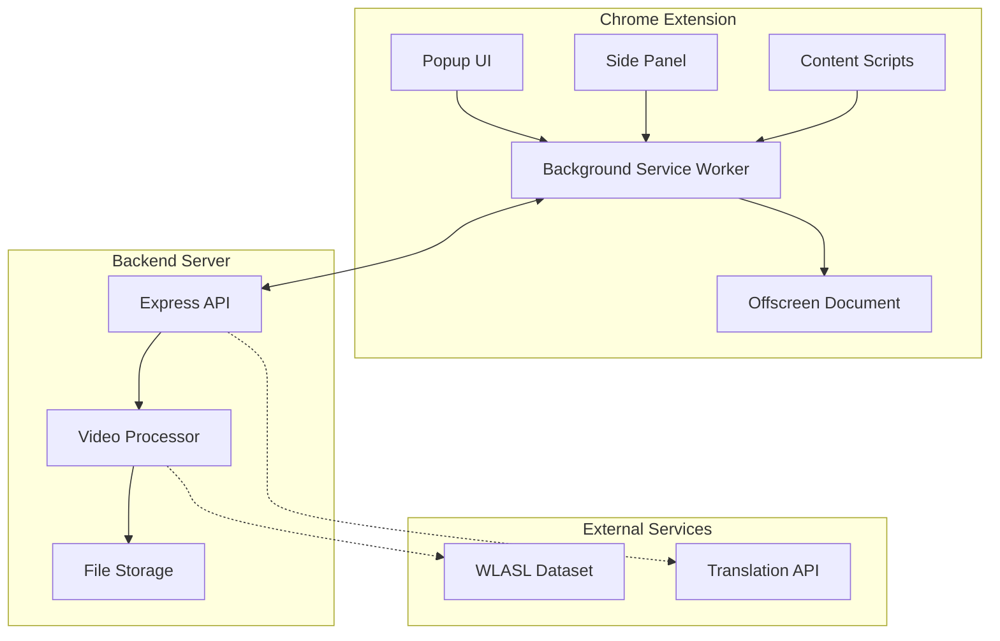

# Project-AID Architecture

## Overview

Project-AID (Audio/Video Integration & Development) is a system designed to generate sign language videos from text input. It consists of a Chrome Extension for the user interface and capturing capabilities, and a Node.js backend for heavy media processing.

## System Architecture

## Components

### 1. Chrome Extension

The extension serves as the primary entry point for the user.

- **Popup (`popup/`)**: Provides the main controls for the user to input text and initiate video generation.
- **Background Script (`background.js`)**: The central coordinator. It handles message passing between different parts of the extension and communicates with the backend server.
- **Side Panel (`sidepanel/`)**: Offers a persistent UI for more complex interactions or displaying results.
- **Offscreen Document (`offscreen/`)**: Used for tasks that require a DOM but don't need to be visible, such as audio playback or specific capturing tasks that can't be done in the service worker.
- **Content Scripts (`content/`)**: Injected into web pages to interact with page content (e.g., capturing captions from YouTube).

### 2. Backend Server

The backend handles resource-intensive tasks that are not suitable for a browser environment.

- **Express Server (`backend/server.js`)**: Exposes REST endpoints for the extension to trigger video generation and other processing tasks.
- **Video Processing**: Uses FFmpeg (via `fluent-ffmpeg` or similar libraries) to stitch together sign language video clips based on the input text.
- **Data Management**: Manages the WLASL dataset and the mapping of words to video files (`wordmap.json`).

### 3. Data Pipeline

- **WLASL Dataset**: The core dataset used for sign language videos. It is downloaded and processed using Python scripts (`download_wlasl.py`, `generate_wordmap.py`).
- **Word Map**: A JSON file that maps English words to their corresponding video files in the dataset, enabling fast lookup during video generation.

## Data Flow

1.  **Input**: User provides text input via the Extension Popup or Side Panel.
2.  **Request**: The Extension sends a request to the Backend API with the text.
3.  **Processing**:
    - The Backend tokenizes the text.
    - It looks up corresponding video clips using the `wordmap.json`.
    - It retrieves the video files from the storage.
    - It stitches the clips together into a single video sequence.
4.  **Response**: The Backend returns the generated video (or a link to it) to the Extension.
5.  **Display**: The Extension displays the generated sign language video to the user.
